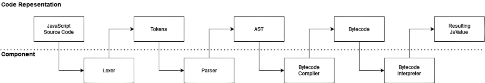

# VM

## Versioned bytecode contract

`CodeBlock::bytecode_contract()` is the supported read-only boundary for code
that needs to inspect interpreter bytecode. Consumers must call `verify()` and
use the returned owned snapshot; the compact byte array, compiler structures,
VM stack, call frames, and inline-cache storage remain private.

The snapshot is tagged with `BYTECODE_CONTRACT_VERSION` and contains verified
instruction boundaries, numeric opcode and name, named operands, register and
index limits, constants (including recursively verified function code),
exception handlers, inline-cache count, and source line/column data. Verification
rejects reserved or undecodable instructions, out-of-range register/constant/
binding/cache operands, non-instruction jump targets, and malformed handlers.
Changing an opcode meaning, operand encoding, or snapshot invariant requires a
contract version bump.

`CodeBlock::jit_metadata()` exposes a copy of interpreter-entry hotness and the
compiled-entry/fallback state. Gate 2 stores no executable pointer: the existing
interpreter is authoritative, and failed or unsupported compilation must remain
on that path. Executable memory and native entry installation belong to Gate 3.

## Interpreter fallback frame

The crate-private Gate 2 frame contract verifies a reusable code-block layout
once, then captures the current program counter, register file, call depth,
argument/register pointers, lexical environment bounds, loop counter, return
value, and pending exception without decoding bytecode again. Restore
is accepted only for the same active frame, the same bytecode contract version,
an instruction-boundary program counter, an exact-size register file, and an
environment depth that can be reached by truncation. Iterator, binding-update,
constructor, async/generator, module, active-native-call, and native-continuation
state is rejected instead of being approximated.
The consumed token returns an explicit continue, return, or throw disposition
to the dispatcher, so fallback cannot infer control flow from a value slot. The
same verified layout supplies PC boundaries and register count at capture and
restore, keeping the hot fallback handoff linear only in the live register file.

The token is a bounded no-safepoint handoff: all copied GC edges remain owned by
the active Boa VM stack. Capture writes into an exact-size register slice owned
and reusable by the caller, so Gate 3 can keep the hot handoff allocation-free.
It must consume the token before interpreter re-entry. Letting a native frame
survive a GC safepoint still requires the independently rooted frame/stack-map
work in Gate 4.

Each verified `ic_index` addresses the same immutable `CodeBlock` cache slot for
the lifetime of that block. Boa owns the receiver/prototype shape guards and slot
actions so raw GC identities never escape to an embedding or compiled-code
adapter. `CodeBlock::inline_cache_metadata()` exposes a read-only diagnostic
snapshot for every slot: empty/monomorphic/polymorphic/megamorphic state, live
bounded entries, hits, misses, installs (including relinks), and victim
replacements. Gate 3 can use
the stable bytecode index and Boa-owned guard operation while telemetry and
fallback decisions remain observable without making cache internals mutable.
Hit/miss/install counters are opt-in per code block, so normal property accesses
do not perform counter updates; bounded-cache replacement state is always kept.
Counters can be reset without discarding warmed guards for repeatable sampling.

## Architecture



## Understanding the trace output

Once set up you can try some simple javascript in your test file. For example:

```js
let a = 1;
let b = 2;
```

Outputs:

```text
----------------------Compiled Output: '<main>'-----------------------
Location  Count    Handler    Opcode                     Operands

000000    0000      none      PushOne
000001    0001      none      PutLexicalValue            0000: 'a'
000006    0002      none      PushInt8                   2
000008    0003      none      PutLexicalValue            0001: 'b'
000013    0004      none      Return

Literals:
    <empty>

Bindings:
    0000: a
    0001: b

Functions:
    <empty>

Handlers:
    <empty>


----------------------------------------- Call Frame -----------------------------------------
Time          Opcode                     Operands                   Top Of Stack

6μs           PushOne                                               1
7μs           PutLexicalValue            0000: 'a'                  <empty>
0μs           PushInt8                   2                          2
1μs           PutLexicalValue            0001: 'b'                  <empty>
0μs           Return                                                <empty>

Stack:
    <empty>


undefined
```

The above output contains the following information:

- The bytecode and properties of the function that will be executed
  - `Compiled Output`: The bytecode.
    - `Location`: Location of the instruction (instructions are not the same size).
    - `Count`: Instruction count.
    - `Handler`: Exception handler, if the instruction throws an exception, which handler is responsible for that instruction and where it would jump. Additionally `>` denotes the beggining of a handler and `<` the end.
    - `Opcode`: Opcode name.
    - `Operands`: The operands of the opcode.
  - `Literals`: The literals used by the bytecode (like strings).
  - `Bindings`: Binding names used by the bytecode.
  - `Functions`: Function names use by the bytecode.
  - `Handlers`: Exception handlers use by the bytecode, it contains how many values should be on the stack and evironments (relative to `CallFrame`'s frame pointers).
- The code being executed (marked by `Vm Start` or `Call Frame`).
  - `Time`: The amount of time that instruction took to execute.
  - `Opcode`: Opcode name.
  - `Operands`: The operands of the opcode.
  - `Top Of Stack`: The top element of the stack **after** execution of instruction.
- `Stack`: The trace of the stack after execution ends.
- The result of the execution (The top element of the stack, if the stack is empty then `undefined` is returned).

### Comparing ByteCode output

If you wanted another engine's bytecode output for the same JS, SpiderMonkey's bytecode output is the best to use. You can follow the setup [here](https://udn.realityripple.com/docs/Mozilla/Projects/SpiderMonkey/Introduction_to_the_JavaScript_shell). You will need to build from source because the pre-built binarys don't include the debugging utilities which we need.

I named the binary `js_shell` as `js` conflicts with NodeJS. Once up and running you should be able to use `js_shell -f tests/js/test.js`. You will get no output to begin with, this is because you need to run `dis()` or `dis([func])` in the code. Once you've done that you should get some output like so:

```text
loc     op
-----   --
00000:  GlobalOrEvalDeclInstantiation 0 #
main:
00005:  One                             # 1
00006:  InitGLexical "a"                # 1
00011:  Pop                             #
00012:  Int8 2                          # 2
00014:  InitGLexical "b"                # 2
00019:  Pop                             #
00020:  GetGName "dis"                  # dis
```
